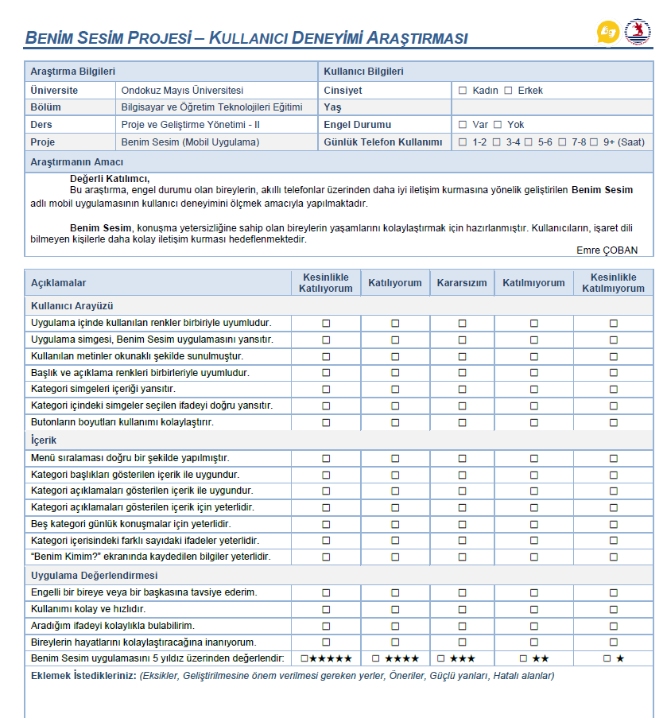
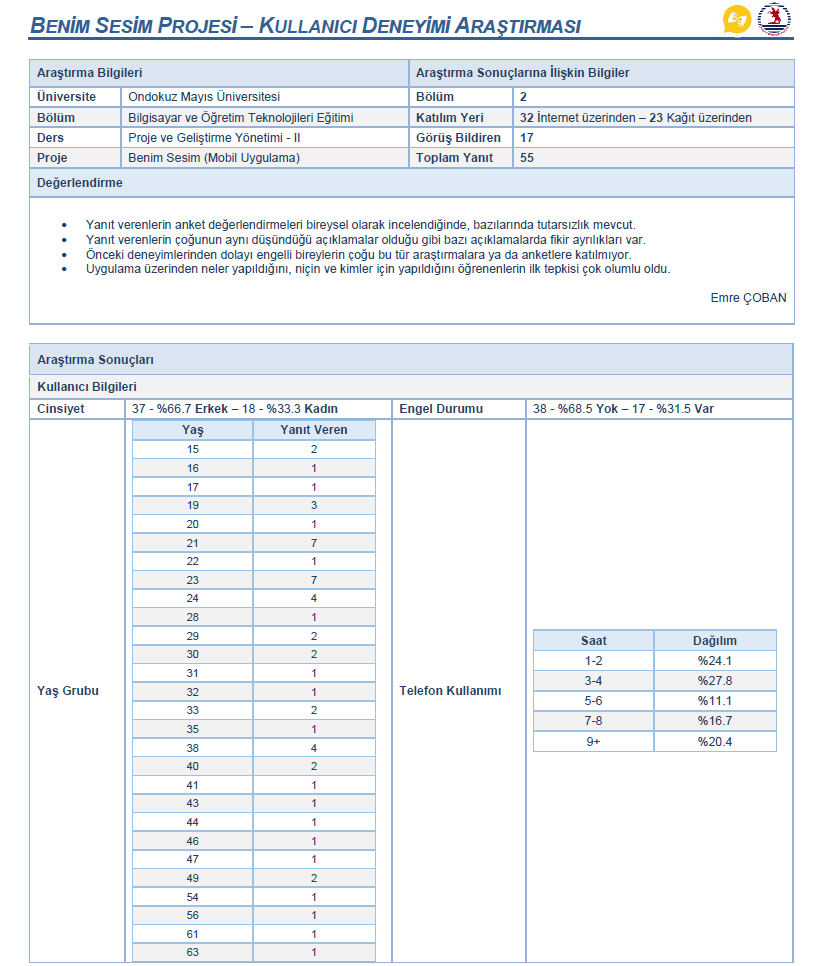
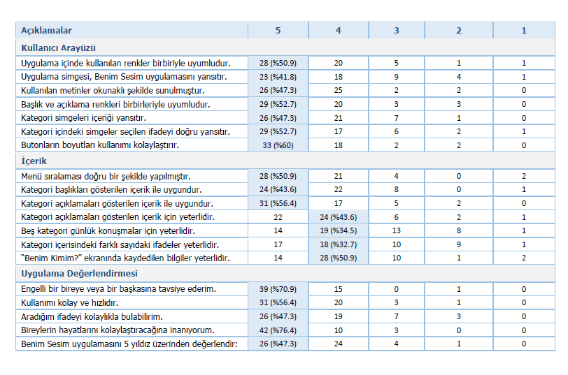
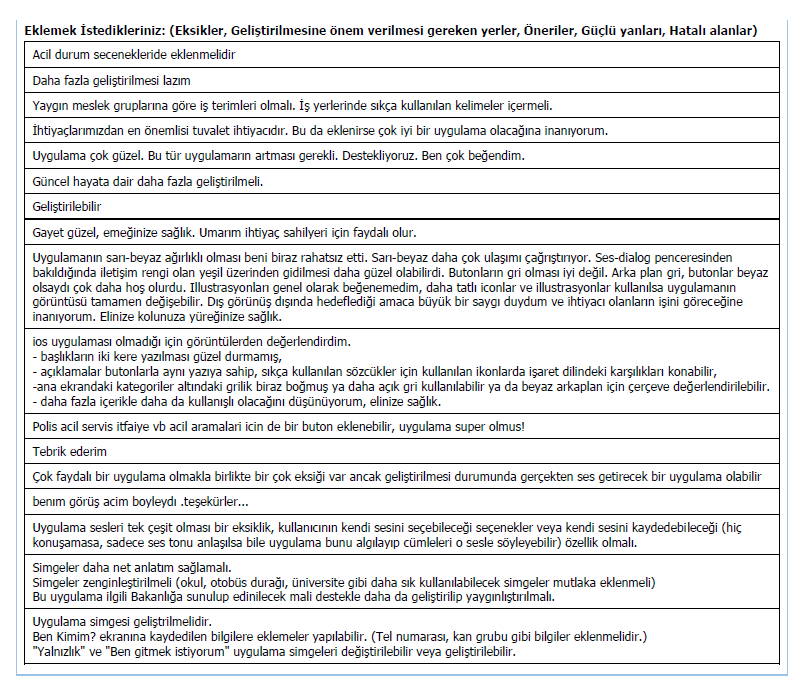
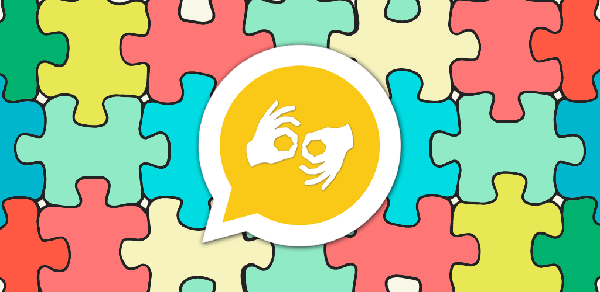
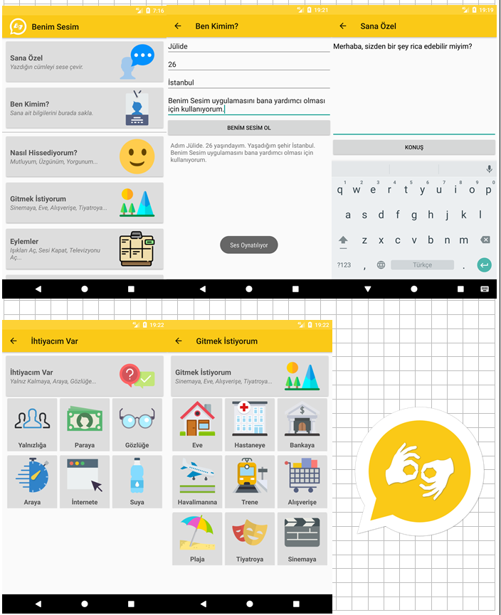
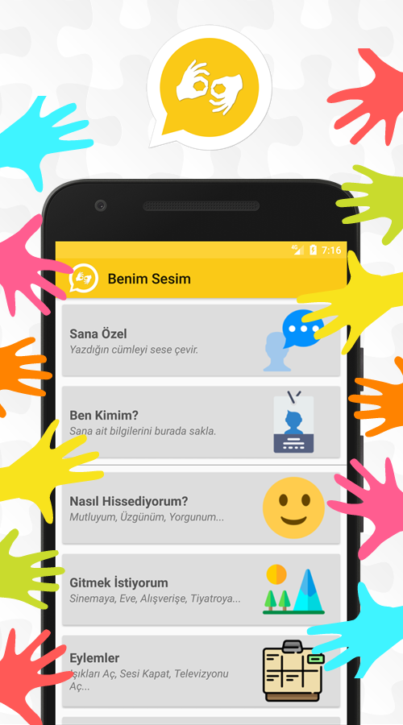
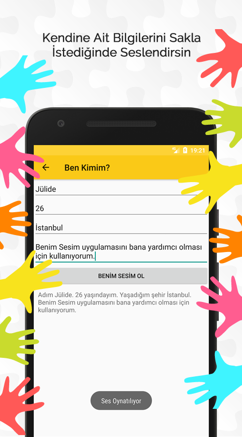
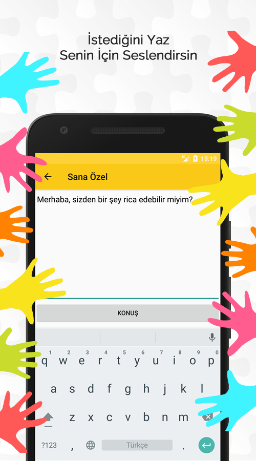

# My Voice
An Android app helps disabled people. The project's aim is to help disabled people to able to communicate more easily with people who do not know sign language. Disabled people can play the ready sentences in the screen.

## Development
During the development process the feedbacks from the disabled people who used the app was taken.

### Survey: User Experience (UX)

#### **The Results**

## Screenshots

